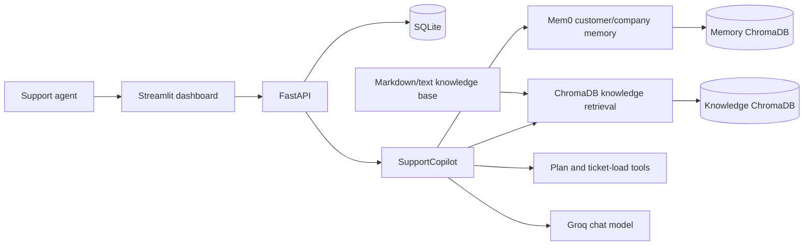
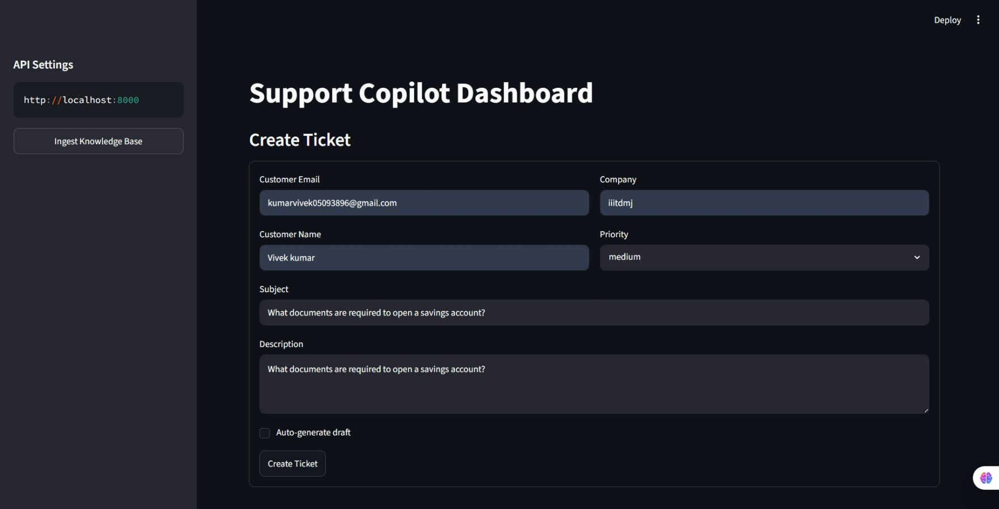

# AI-Powered Customer Support Agent

An agent-facing support copilot that creates grounded response drafts using customer history, a local knowledge base, and callable account tools. It combines a FastAPI API with a Streamlit dashboard and persists ticket, vector, and memory data locally by default.

[](https://www.python.org/)
[](https://fastapi.tiangolo.com/)
[](https://streamlit.io/)
[](https://www.langchain.com/)
[](https://www.trychroma.com/)
[](https://www.docker.com/)
[](#license)

---

## Features

- 🤖 Generates concise support-response drafts with a Groq-hosted language model.
- 🧠 Remembers accepted resolutions at customer and company scope with Mem0.
- 📚 Grounds answers in Markdown and text knowledge-base files through ChromaDB retrieval.
- 🛠️ Calls structured tools for customer plan/SLA and open-ticket context.
- 🎫 Creates, lists, retrieves, and resolves tickets stored in SQLite.
- ✍️ Supports draft review, editing, acceptance, and discard workflows.
- 🔎 Exposes memory search and draft context, including sources and tool traces.
- ⚡ Supports background draft generation when a ticket is created.
- 🖥️ Includes an agent dashboard and interactive OpenAPI documentation.
- 🐳 Runs locally or as API and dashboard containers with Docker Compose.

## Tech Stack

| Layer | Technologies |
| --- | --- |
| API | Python 3.11+, FastAPI, Uvicorn, Pydantic |
| Dashboard | Streamlit, Requests |
| Agent | LangChain, LangGraph in-memory checkpointing, Groq |
| Retrieval | ChromaDB; Gemini or Chroma's local default embeddings |
| Long-term memory | Mem0 with ChromaDB; Gemini, OpenAI, or opt-in local Hugging Face embeddings |
| Persistence | SQLite, local ChromaDB collections |
| Packaging | uv, `pyproject.toml` |
| Deployment | Docker, Docker Compose |

## Project Structure

<details open>
<summary>Repository layout</summary>

```text
.
├── app.py                              # Streamlit agent dashboard
├── main.py                             # FastAPI/Uvicorn entry point
├── customer_support_agent/
│   ├── api/
│   │   ├── app_factory.py              # App setup and router registration
│   │   ├── dependencies.py             # Dependency providers
│   │   └── routers/                    # Health, ticket, draft, KB, and memory APIs
│   ├── core/settings.py                # Environment-backed configuration
│   ├── integrations/
│   │   ├── memory/mem0_store.py        # Persistent customer/company memory
│   │   ├── rag/chroma_kb.py            # KB ingestion and semantic retrieval
│   │   └── tools/support_tools.py      # Agent-callable support tools
│   ├── repositories/sqlite/            # Customer, ticket, and draft persistence
│   ├── schemas/api.py                  # Request and response models
│   └── services/                       # Copilot, draft, and KB orchestration
├── knowledge_base/                     # Source documents for retrieval
├── data/                               # SQLite and ChromaDB data
├── docs/
│   ├── images/                         # README screenshots
│   └── demo/                           # Demo recordings
├── notebooks/experiments.ipynb         # Development experiments
├── tests/                              # Automated tests
├── Dockerfile
├── docker-compose.yml
├── pyproject.toml
└── uv.lock
```

</details>

## Architecture



When a ticket is submitted, the API creates or reuses the customer and stores the ticket in SQLite. Draft generation then:

1. Searches customer-specific and normalized company memory.
2. Retrieves relevant chunks from the ChromaDB knowledge collection.
3. Supplies that context to a LangChain agent backed by Groq.
4. Allows the agent to inspect deterministic plan/SLA data and the customer's open-ticket load.
5. Persists the draft and a structured audit context containing retrieval hits, tool calls, highlights, and errors.

Accepting a draft marks its ticket as resolved and saves the approved resolution to long-term memory. If memory initialization fails, draft generation continues without memory and records the failure in the draft context.

## Installation

### Prerequisites

- Python 3.11 or newer
- [uv](https://docs.astral.sh/uv/) (recommended)
- A Groq API key for draft generation
- One memory embedding option: Google API key (recommended), OpenAI API key, or local embeddings

### Local setup with uv

```bash
git clone https://github.com/Vivekk-007/AI-Powered-Customer-Support-Agent-with-Memory-and-Tool-Calling.git
cd AI-Powered-Customer-Support-Agent-with-Memory-and-Tool-Calling

uv sync --frozen
```

Create a `.env` file in the repository root using the configuration below. On Windows PowerShell, virtual-environment activation is unnecessary when commands run through `uv run`.

<details>
<summary>Alternative pip installation</summary>

```bash
python -m venv .venv

# Linux/macOS
source .venv/bin/activate

# Windows PowerShell
.venv\Scripts\Activate.ps1

python -m pip install --upgrade pip
pip install .
```

</details>

## Environment Variables

Pydantic loads `.env` automatically; `API_BASE_URL` is read directly by the dashboard.

| Variable | Required | Default | Description |
| --- | :---: | --- | --- |
| `GROQ_API_KEY` | For AI drafts | — | Groq credential used by the agent and Mem0 LLM. |
| `GROQ_MODEL` | No | `llama-3.1-8b-instant` | Groq chat model identifier. |
| `LLM_TEMPERATURE` | No | `0.2` | Draft-generation temperature. |
| `GOOGLE_API_KEY` | Recommended | — | Gemini embeddings for knowledge retrieval and Mem0. |
| `OPENAI_API_KEY` | Alternative | — | Alternative Mem0 embedding provider. |
| `ENABLE_LOCAL_EMBEDDINGS` | Alternative | `false` | Uses local Hugging Face `all-MiniLM-L6-v2` embeddings for Mem0. |
| `GOOGLE_EMBEDDING_MODEL` | No | `gemini-embedding-001` | Gemini embedding model. Legacy aliases are normalized. |
| `RAG_CHUNK_SIZE` | No | `800` | Knowledge chunk size in characters. |
| `RAG_CHUNK_OVERLAP` | No | `120` | Overlap between adjacent chunks. |
| `RAG_TOP_K` | No | `4` | Knowledge chunks retrieved per draft. |
| `MEM0_TOP_K` | No | `5` | Memories retrieved per scope. |
| `DB_PATH` | No | `data/support.db` | SQLite database path. |
| `CHROMA_RAG_DIR` | No | `data/chroma_rag` | Persistent knowledge-vector directory. |
| `CHROMA_MEM0_DIR` | No | `data/chroma_mem0` | Persistent memory-vector directory. |
| `KNOWLEDGE_BASE_DIR` | No | `knowledge_base` | Directory containing `.md` and `.txt` knowledge files. |
| `API_HOST` | No | `0.0.0.0` | API bind host. |
| `API_PORT` | No | `8000` | API bind port. |
| `API_BASE_URL` | Dashboard only | `http://localhost:8000` | API URL used by Streamlit; Compose uses `http://api:8000`. |

Minimal example:

```dotenv
GROQ_API_KEY=your_groq_api_key
GOOGLE_API_KEY=your_google_api_key
API_BASE_URL=http://localhost:8000
```

> [!NOTE]
> Ticket operations and knowledge ingestion can run without `GROQ_API_KEY`; AI draft and memory endpoints remain unavailable until credentials are configured.

## Usage

Start the API and dashboard in separate terminals:

```bash
# Terminal 1 — API at http://localhost:8000
uv run python main.py

# Terminal 2 — dashboard at http://localhost:8501
uv run streamlit run app.py
```

Useful URLs:

- Dashboard: <http://localhost:8501>
- Swagger UI: <http://localhost:8000/docs>
- ReDoc: <http://localhost:8000/redoc>
- Health check: <http://localhost:8000/health>

Before generating drafts, add `.md` or `.txt` files to `knowledge_base/`, then select **Ingest Knowledge Base** in the dashboard or call the ingestion endpoint.

### Docker Compose

```bash
docker compose up --build
```

This starts the API on port `8000` and dashboard on port `8501`. The `data/` and `knowledge_base/` directories are mounted into both services so application state survives container recreation.

```bash
docker compose down
```

## API Endpoints

| Method | Endpoint | Purpose |
| --- | --- | --- |
| `GET` | `/health` | Service health check. |
| `POST` | `/api/tickets` | Create a ticket; optionally queue background draft generation. |
| `GET` | `/api/tickets` | List up to 100 recent tickets. |
| `GET` | `/api/tickets/{ticket_id}` | Retrieve one ticket. |
| `POST` | `/api/tickets/{ticket_id}/generate-draft` | Generate and persist a draft. |
| `GET` | `/api/drafts/{ticket_id}` | Get the latest draft for a ticket. |
| `PATCH` | `/api/drafts/{draft_id}` | Edit a draft or change its review status. |
| `POST` | `/api/knowledge/ingest` | Ingest the knowledge directory into ChromaDB. |
| `GET` | `/api/customers/{customer_id}/memories` | List customer and company memories. |
| `GET` | `/api/customers/{customer_id}/memory-search?query=...&limit=10` | Search memory; limit is capped at 25. |

<details>
<summary>Example API calls</summary>

```bash
curl -X POST http://localhost:8000/api/knowledge/ingest \
  -H "Content-Type: application/json" \
  -d '{"clear_existing": false}'

curl -X POST http://localhost:8000/api/tickets \
  -H "Content-Type: application/json" \
  -d '{
    "customer_email": "alex@example.com",
    "customer_name": "Alex Rivera",
    "customer_company": "Acme Labs",
    "subject": "Savings account requirements",
    "description": "Which documents are required to open a savings account?",
    "priority": "medium",
    "auto_generate": true
  }'
```

</details>

## Example Workflow

1. Place support policies or FAQs in `knowledge_base/` and ingest them.
2. Open the dashboard and submit the customer's identity, priority, subject, and description.
3. Generate a draft manually or enable automatic generation on ticket creation.
4. Review retrieved memories, knowledge sources, and tool calls under **Context used**.
5. Edit the response, then accept or discard it.
6. On acceptance, the ticket becomes resolved and the approved answer is stored for relevant future tickets.
7. Use **Memory Probe** to verify what the copilot recalls for that customer.

## Demo

### Support Copilot Dashboard

The dashboard provides ticket creation, knowledge ingestion, draft review, and memory inspection in one agent workspace.



## Demo Videos

### Ticket and Draft Workflow

[](docs/demo/ticket-and-draft-workflow.mp4)

### Memory and Knowledge Workflow

[](docs/demo/memory-and-knowledge-workflow.mp4)

> [!IMPORTANT]
> Both demo files exceed GitHub's standard 100 MB per-file limit. Track `docs/demo/*.mp4` with [Git LFS](https://git-lfs.com/) before committing, or upload them as GitHub release/user attachments and replace these local links.

## Future Improvements

- Add authentication, role-based access, and restricted CORS origins for production.
- Replace deterministic demo plan lookup with authenticated CRM, billing, and help-desk integrations.
- Add reply-delivery channels and ticket-system webhooks.
- Introduce migrations and a production database such as PostgreSQL.
- Add retrieval reranking, evaluation, and source citations in generated replies.
- Move background generation to a durable task queue with retries and observability.
- Expand automated API, repository, retrieval, and end-to-end dashboard coverage.

## Contributing

Contributions are welcome:

1. Fork the repository and create a focused branch: `git checkout -b feat/short-description`.
2. Install dependencies with `uv sync --frozen`.
3. Keep credentials and generated local data out of commits.
4. Add or update tests for behavioral changes and run the test suite.
5. Open a pull request describing the motivation, implementation, and verification steps.

For substantial features or API changes, open an issue first so the design can be discussed before implementation.

## Author

**vivekkk-007**

- GitHub: [@Vivekk-007](https://github.com/Vivekk-007)
- Email: [kumarvivek05093896@gmail.com](mailto:kumarvivek05093896@gmail.com)

Author information is derived from the repository's latest Git commit and configured origin.

## License

No license file or package license declaration is currently present. Consequently, the source is **not licensed for reuse by default**. Add a `LICENSE` file (for example, MIT or Apache-2.0) before inviting redistribution or external contributions.
